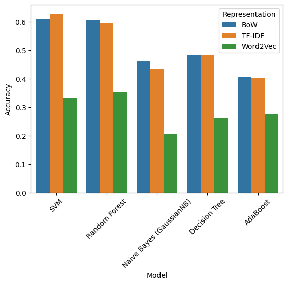
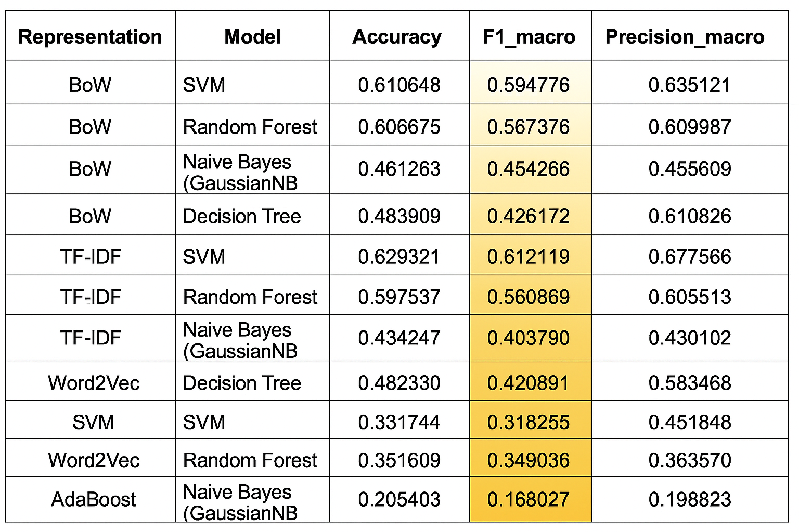

# Sentiment Analysis Project Using Natural Language Processing (NLP)

## Project Overview
This project aims to analyze the sentiment of Arabic tweets using Natural Language Processing (NLP) techniques. The project includes various stages, starting with data exploration and analysis, moving on to text preprocessing, and finally applying machine learning models to evaluate the performance of different text representations in sentiment classification.

## Project Objectives
- Explore and analyze a tweet dataset to understand its characteristics and the distribution of sentiment.
- Apply Arabic text preprocessing techniques to clean the data and prepare it for analysis.
- Use different text representations (such as Bag-of-Words, TF-IDF, Word2Vec) to convert texts into digital formats that can be processed by machine learning models.
- Train and evaluate several machine learning models (such as SVM, Random Forest, Naive Bayes, Decision Tree, AdaBoost) for sentiment classification.
- Compare the performance of different models against various text representations to determine the best one.

## Data
The data used in this project is based on the `Emotional-Tone-Dataset.csv` file, which contains Arabic tweets categorized by emotion. Each row in the dataset consists of a unique tweet identifier, the tweet text, and the corresponding emotional label (e.g., 'joy', 'sadness', 'anger', 'none', 'love', 'fear', 'sympathy', 'surprise').

## Methodology
The project consists of the following main steps:

### 1. Exploration Data Analysis (EDA)
- Load the data and convert the tweet column to a `string` type.
- Examine the raw data using functions such as `head()`, `sample()`, `info()`, and `describe()`.
- Analyze missing values and data shape.
- Visualize the distribution of emotions in the dataset using histograms.
- Explore text characteristics such as tweet length, number of emojis, and number of unique characters.
- Analyzing the frequency of the most common words in the texts in general and for each sentiment category separately.

### 2. Text Preprocessing
This stage involves applying a series of techniques to clean and standardize the texts:
- **Punctuation Removal:** Removing all punctuation from tweets.
- **HTML Tag Removal:** Cleaning the texts of any HTML tags that may be present.
- **Arabic Diacritical Removal:** Removing vowels and diacritics from Arabic texts.
- **Emoji Substitution:** Converting emojis into textual descriptions (for example, 😃 becomes :grinning_face:).
- **Number Removal:** Removing all numbers from the texts.
- **Stop Word Removal and Lemmatization:** Removing common words that do not add significant meaning (such as prepositions) and standardizing words to their linguistic roots.

### 3. Text Representation
After preprocessing, the texts are converted into numerical representations:
- **Bag-of-Words (BoW):** Represents texts as vectors based on word frequency.
- **TF-IDF (Term Frequency-Inverse Document Frequency):** Represents texts based on the importance of words in the document relative to the overall collection of documents.
- **Word2Vec (FastText):** Uses word embedding models to represent words as dense vectors that capture contextual meaning.

### 4. Model Building and Evaluation
- **Label Encoding:** Converts textual sentiment labels into numerical values.
- **Data Splitting:** Splitting the dataset into training and test sets.
- **Model Training:** The following models are trained on each text representation:
- Support Vector Machine (SVM)
- Random Forest
- Naive Bayes (GaussianNB)
- Decision Tree
- AdaBoost

  
    

- **Performance Evaluation:** The performance of each model is evaluated using metrics such as accuracy and F1-score (Macro Average), as well as classification reports and confusion matrices.

## Results
The results of the model evaluation are presented in a table that compares the performance of each model against each text representation, focusing on accuracy and F1-score. Graphical representations are also provided to visually compare performance.
  

  
## Requirements (Dependencies)
Running this project requires the following libraries:
- `pandas`
- `matplotlib`
- `seaborn`
- `plotly`
- `emoji`
- `nltk`
- `beautifulsoup4`
- `spacy` (`en_core_web_sm` model)
- `gensim`
- `numpy`
- `scikit-learn`
- `xgboost`

These requisites can be installed using `pip`:
```bash
pip install pandas matplotlib seaborn plotly emoji nltk beautifulsoup4 spacy gensim numpy scikit-learn xgboost
```

**Note:** You may need to download some `nltk` and `spacy` resources after installing Installation:
```bash
nltk.download('stopwords')
nltk.download('punkt')
nltk.download('wordnet')
python -m space download en_core_web_sm
```
